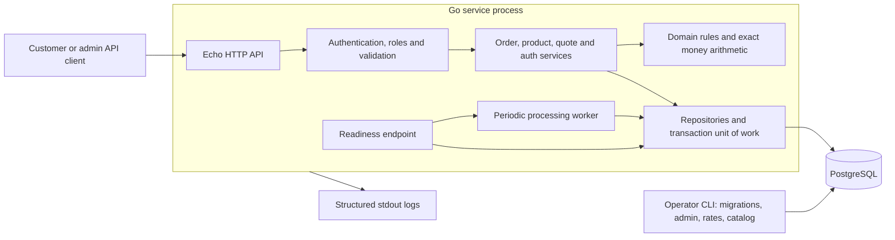
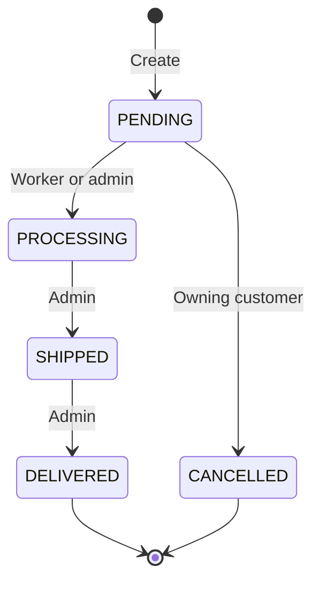
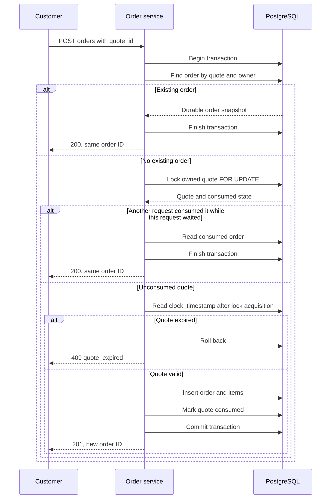

# Order Processing System — architecture design discussion

This document explains the implementation and the decisions behind it, and can
be used during an architecture interview or the live demo. Source review date:
2026-10-03. The system is a **layered monolith with an embedded worker and one
PostgreSQL database**. Its main correctness mechanisms are database transactions,
conditional state changes, immutable purchase snapshots and bounded batch work.

Implementation and verification are separate: selected local tests have passed;
full dependency/build/HTTP/PostgreSQL/Docker acceptance remains blocked in the
recorded environment. No production throughput, availability target or code
coverage percentage has been measured. See the
[verification record](docs/reviews/order-processing-hardening/verification/README.md).

## 1. Requirements and design boundaries

| Requirement | Design response |
| --- | --- |
| Create orders with multiple items | Transactionally persist an order and its item snapshots, using catalog prices and the authenticated customer. |
| Retrieve an order | Fetch by UUID with customer ownership enforced; admins can retrieve any order. |
| Update status | Enforce one forward transition through PENDING, PROCESSING, SHIPPED and DELIVERED. |
| Automatically process pending orders every five minutes | Run a ticker in the service; drain eligible rows in bounded PostgreSQL batches. |
| List orders, optionally filtered by status | Use owner/status filters and cursor pagination. |
| Cancel only while pending | Apply a conditional PENDING → CANCELLED update in a transaction. |

Approved additions are customer/admin authentication, an admin-managed catalog,
regional price quotes backed by managed exchange rates, quote replay protection,
authentication limits, readiness checks, structured logs and acceptance tooling.
Payments, inventory reservation, delivery-provider integration, product editing,
frontend UI, password recovery and refresh tokens remain outside this assignment.
SHIPPED and DELIVERED are recorded statuses; there is no external shipment action.

## 2. Why Go for this system?

Go fits a small network service with concurrent HTTP requests, a periodic worker
and explicit transactional rules. The decision prioritizes a straightforward
deployment and code that makes state changes easy to review. It is not based on
a benchmark claiming that another language could not satisfy the requirements.

| Go capability | Concrete use here | Tradeoff |
| --- | --- | --- |
| Compiled, statically typed code | Domain types, repository interfaces and compile-time adapter assertions connect the layers. | Compilation cannot establish money correctness, authorization or transaction safety; those still need tests. |
| Goroutines and synchronization primitives | Bootstrap runs HTTP serving and the worker concurrently; a mutex protects worker health, and a buffered channel bounds concurrent auth work. | Goroutines need cancellation and resource bounds; they do not coordinate different machines. |
| Interfaces and explicit construction | Bootstrap supplies repositories and services; tests use small fakes for quote/worker behavior. | Some plumbing and error propagation are intentionally explicit. |
| Standard tooling | `gofmt`, `go vet`, `go test` and race-enabled tests support consistent verification. | The race detector only finds races exercised at runtime; it does not prove database concurrency correctness. |
| Binary deployment | The Docker build uses `CGO_ENABLED=0` and copies the built executable into a non-root Alpine image. | The service still requires PostgreSQL, configuration, certificates, dependency preparation and operational monitoring. |
| Standard numeric and context packages | `math/big.Rat` implements exact conversion; context flows from handlers/worker into database operations. | Go has no application money type that automatically enforces currency, rounding and overflow rules; these are implemented explicitly. |

Go's language and concurrency design are described in the [Go FAQ](https://go.dev/doc/faq).
Cancellation/deadline propagation follows the [context contract](https://pkg.go.dev/context).
The limitations of dynamic race checking are described in the
[Go race detector documentation](https://go.dev/doc/articles/race_detector).
The concrete uses above are visible in [bootstrap](internal/bootstrap/server.go),
[money conversion](domain/money/money.go), [Dockerfile](Dockerfile) and
[Makefile](Makefile).

### Why not Java, .NET, Node.js, Python or Rust?

All are viable. The following is a project-specific tradeoff assessment, not a
general performance ranking. Existing team expertise could reasonably change the
choice without changing the domain model or PostgreSQL consistency strategy.

| Alternative | Why it would work | Why Go is reasonable here / when to choose the alternative |
| --- | --- | --- |
| Java with a web framework | Java supports concurrent network services, including [virtual threads](https://docs.oracle.com/en/java/javase/25/core/virtual-threads.html). | This assignment does not require an existing JVM application platform. Go keeps the selected implementation in one executable with explicit composition. A JVM-skilled team or existing Java services could favor Java. Virtual threads still need DB connection limits. |
| C# / ASP.NET Core | ASP.NET Core supports asynchronous request handling; Microsoft documents [async I/O and blocking-work considerations](https://learn.microsoft.com/en-us/aspnet/core/fundamentals/best-practices?view=aspnetcore-10.0). | Go is a practical choice for this repository's existing types, worker and tooling. An established .NET team could implement the same design effectively; deployment simplicity alone is not a reason to reject .NET. |
| TypeScript / Node.js | Well suited to asynchronous I/O, with [event-loop and worker-pool guidance](https://nodejs.org/learn/asynchronous-work/dont-block-the-event-loop). | Go lets the HTTP server and worker share one concurrency model. Node remains suitable, but CPU-heavy password work must avoid blocking the event loop and money needs an explicit exact representation. A TypeScript-first team may prefer it. |
| Python | [asyncio](https://docs.python.org/3/library/asyncio.html) supports concurrent network and database I/O. | Go provides compile-time interface checks and an executable deployment for this implementation. Python is reasonable where team productivity or a Python ecosystem matters more; production process/concurrency choices still require measurement. |
| Rust | [Ownership](https://doc.rust-lang.org/book/ch04-01-what-is-ownership.html) provides memory-safety guarantees without a garbage collector. | The assignment has no measured requirement for avoiding GC or for unusually tight resource control. Go is sufficient for the chosen design; Rust becomes attractive where those constraints or team expertise justify it. |

Go's garbage collector, scheduler and allocations still affect latency. Explicit
error handling can be repetitive. Echo and GORM do not eliminate framework or
database coupling. Most importantly, changing language would not solve duplicate
submissions, cancellation races or expired quotes: those are data-design problems.

## 3. High-level design (HLD)



The deployment in [Compose](docker-compose.yml) starts PostgreSQL, runs the
migration command, then starts the API after migrations succeed. API and worker
share a process and connection pool. The database stores orders, catalog, users,
token revocations, rates and quotes. The CLI is another invocation of the same
binary, used for privileged setup and maintenance.

The monolith keeps order creation, quote consumption and status changes inside
one database transaction boundary. Microservices would introduce network failure
and cross-service coordination without a current requirement for separate
ownership or deployment. These packages are logical modules, not independently
deployed services. Separate command/query handlers organize code; there are no
separate CQRS read databases, event store, Redis cache or message broker.

PostgreSQL supplies relational constraints and transactional updates. GORM handles
ordinary persistence, while the queue and cleanup paths use explicit SQL where
locking and query shape matter. Explicit versioned SQL migrations make schema
changes reviewable; startup does not perform GORM auto-migration.

Existing-data upgrades require a maintenance window: stop old writers, apply
migrations, explicitly adopt the original catalog currency where required, import
rates and start the compatible application. Readiness currently expects exactly
schema version 3, so zero-downtime mixed-version upgrades are not established.
Down migrations guard against losing pricing provenance; after new monetary
writes, prefer forward repair. Migration rollback tests use disposable data.

## 4. Low-level design (LLD)

### Packages, responsibilities and dependency direction

| Layer / source | Responsibility and key contracts |
| --- | --- |
| [HTTP routes](api/rest/routes/routes.go) and [handlers](api/rest/v1/order_handler.go) | Route registration, DTO validation, role/owner scope, response formatting and HTTP status selection. |
| [Order service](service/order/command_handler.go) | `HandleCreate`, `HandleStatus`, `HandleCancel`; read handlers delegate scoped queries. |
| [Quote service](service/quote/service.go) and [quote consumption](service/order/quote_handler.go) | Select region/rate, freeze a quote, then atomically consume it or replay its existing order. |
| [Domain order](domain/order/order.go) and [money](domain/money/money.go) | Pure item/total validation, previous-state mapping, conversion, precision and overflow checks. No HTTP or GORM dependency. |
| [Unit-of-work interface](service/uow/uow.go) | Execute a callback using repositories bound to one transaction; read database time. |
| [Persistence](db/gorm/order_repository.go) | Implement repositories, scoped reads, inserts, conditional updates and worker batch SQL. |
| [Auth adapter](service/auth/jwt/client.go) | Password verification, JWT issuance/validation, current-user lookup and logout revocation. |
| [Worker](service/processing/worker.go) | Schedule drains, enforce batch/run bounds and publish [local health](service/processing/status.go). |
| [Bootstrap](internal/bootstrap/server.go) and [configuration](configs/config.go) | Construct dependencies, validate settings, start/stop HTTP and worker, configure readiness. |

The domain declares repository abstractions; persistence implements them. Services
depend on those abstractions and the unit of work. Bootstrap supplies concrete
implementations. HTTP request DTOs and GORM row structs remain outside the domain.

### Data model and database safeguards

| Table | Important fields / relationships | Safeguards |
| --- | --- | --- |
| `users` | UUID, normalized email, password hash, role, active flag | Unique email; customer/admin role constraint. Registration always creates a customer. |
| `products` | UUID, SKU, name, positive `price_minor` | Unique SKU; price in the catalog's single base currency. |
| `catalog_settings` | Singleton row containing `base_currency` | Singleton key; supported currency constraint; application rejects later currency mismatch. |
| `orders` | UUID, customer FK, status, currency, total, optional quote ID, pricing provenance | Valid status and positive total; unique non-null quote ID; provenance checks. |
| `order_items` | Order FK, position, product FK, name/SKU/price snapshots, quantity, line total | Unique product per order; positive values; `line_total = quantity × unit_price`; delete with parent order. |
| `fx_rates` | UUID, base/target, decimal rate, finite validity interval, source | Positive `NUMERIC(24,12)` rate; valid interval; application import serializes overlap checks. |
| `order_quotes` | Customer FK, amounts, region/mapping version, rate snapshot, expiry, optional consumed-order FK | Expiry after creation; positive values; unique consumed order. |
| `quote_items` | Quote FK, position, product FK, source and converted prices | Unique product per quote; checked line totals; delete with parent quote. |
| `denylisted_tokens` | SHA-256 token hash and expiry | Primary key makes revocation insertion repeatable; raw token is not persisted here. |

See the [initial schema](db/migrations/000001_initial.up.sql),
[pricing migration](db/migrations/000002_pricing.up.sql) and
[quote migration](db/migrations/000003_order_quotes.up.sql).

`orders.quote_id` intentionally has no FK to the temporary quote table: the
accepted order and its retry identity survive quote cleanup. Conversely,
`order_quotes.consumed_order_id` references the durable order. Order item snapshots
preserve purchased names and prices even if catalog values later change.

Database constraints are defense in depth, not every business rule. The aggregate
order total is calculated in the application; no cross-row sum constraint enforces
it. There is no database trigger enforcing the full status graph. Catalog
immutability and non-overlapping rates depend on authorized application/CLI write
paths; direct SQL writers must follow the same rules.

| Query | Index / bounding strategy |
| --- | --- |
| Pending queue | Partial `(created_at, id)` index where `status = 'PENDING'`; oldest first, bounded batch. |
| Customer order list | `(customer_id, id DESC)`; owner plus optional cursor. |
| Customer status filter | `(customer_id, status, id DESC)`. |
| Admin status filter | `(status, id DESC)`; unfiltered order UUID primary key also supports ID traversal. |
| Active rates | `(base_currency, target_currency, valid_from, valid_until)`. |
| Expired quotes / revoked tokens | Separate expiry indexes. Quote deletion is bounded; token purge currently deletes all eligible rows in one operation. |

Order/product pagination uses UUIDv7 descending and `id < cursor`, fetching one
extra row to determine `next_cursor`. This avoids deep offset scans. UUID order is
not a cross-machine commit sequence or a snapshot of all pages; newly inserted or
status-changing rows can change results between requests. Each nonempty order
page loads its items in one additional query, avoiding a query per order.

### Multi-item order creation

1. Validate JWT and read the current user/role; derive the customer from that user.
2. Parse a strict JSON body. Accept 1–100 distinct products with positive quantities.
3. Begin a unit-of-work transaction and fetch all requested catalog products.
4. Read persisted catalog currency and database time. Build immutable item snapshots.
5. Check multiplication and total addition before `int64` overflow; reject unknown
   products, duplicate items or invalid amounts.
6. Insert order and items using the same transaction. A failure rolls everything back.
7. After commit, log the mutation and return 201 with a `Location` header.

No client price, customer ID or role can replace these server-controlled values.
The items-only create request has **no general idempotency key**. Retrying after
an ambiguous network failure can create another order; quote-backed creation has
a stronger replay contract described below.

### State machine and cancellation race



The repository performs a conditional update using ID, expected previous status
and, for cancellation, customer ID. It then reads the resulting order in the same
transaction. A missing/inaccessible order returns 404; an accessible order in the
wrong state returns 409. It does not read PENDING first and later update blindly.
Manual transitions and cancellation set `updated_at` using PostgreSQL `now()`,
matching the worker's database clock rather than relying on the API host's clock.

For cancellation versus processing, PostgreSQL row locks serialize competing
writes, and the losing operation cannot also change the old PENDING state. A
worker skips a row already locked by cancellation; cancellation that encounters an
already processed order returns 409. This protects the transition across processes,
where an in-memory Go mutex would be insufficient.

### Five-minute processing algorithm

The first tick occurs five minutes after worker startup, followed by five-minute
ticks. Orders need not be five minutes old. Each run captures a cutoff, processes
PENDING rows created at or before it, and repeats batches until none are selected
or the run fails/times out. Newer rows wait for a later run.

The following is the implemented SQL shape, with named placeholders for clarity:

```sql
WITH batch AS (
    SELECT id FROM orders
    WHERE status = 'PENDING' AND created_at <= :cutoff
    ORDER BY created_at, id
    LIMIT :batch_size FOR UPDATE SKIP LOCKED
), updated AS (
    UPDATE orders AS o
    SET status = 'PROCESSING', updated_at = now()
    FROM batch
    WHERE o.id = batch.id AND o.status = 'PENDING'
    RETURNING o.id
)
SELECT count(*) FROM updated;
```

Default batch size is 500, allowed range 1–10000. This is **500 per transaction,
not 500 per five minutes**: a tick can drain many batches. Each run is sequential
within one process and has a deadline equal to its interval. Successful prior
batches stay committed if a later batch fails. A short batch does not end the
drain; an empty one does. Locked rows can remain pending until a later tick.

`SKIP LOCKED` permits queue consumers to avoid waiting on one another; it does
not provide a consistent general-purpose read or strict FIFO fairness. PostgreSQL
documents this queue-oriented use in its [SELECT locking clauses](https://www.postgresql.org/docs/18/sql-select.html).
The literal PENDING predicate matches the partial index, keeping historical orders
out of the queue index; query-plan tests must still verify actual index use.

### Regional pricing, exact money and quote consumption

The catalog has one persisted base currency. On a fresh catalog, `STORE_REGION`
selects its initial currency unless `CURRENCY` explicitly sets it. Thereafter,
changing the region changes default new quotes only; a mismatched explicit
currency fails startup. Existing data requires explicit currency adoption, and
conflicting historical currencies are rejected.

Supported mappings are US→USD, IN→INR, GB→GBP, JP→JPY, KW→KWD and DE/FR→EUR.
An operator imports immutable dated rate versions through the CLI. There is no
external FX feed or silent fallback for an unavailable rate. Imports lock the
catalog settings row while checking overlaps and inserting, serializing concurrent
imports. This conservatively serializes all pairs, which is adequate for infrequent
operator changes.

For each unit price:

```text
target_minor = half_even(source_minor × target/base rate × 10^target_digits / 10^source_digits)
line_total   = target_minor × quantity
order_total  = sum(line_total)
```

Calculations use exact rational arithmetic; JPY has 0 minor digits, KWD 3 and the
other supported currencies 2. Round once per unit, then multiply by quantity.
Reject zero-rounded or out-of-range values. With the demo fixture USD→INR rate 2,
USD 3495 minor units becomes INR 6990 for the demonstrated cart. The rate is a
test fixture, not a market-price claim.

A quote persists owner, items, region/mapping version, source values, converted
values, rate provenance and expiry. Expiry is the earlier of quote TTL (default
five minutes) and rate expiry. Submission uses only `quote_id`:



The quote lock and unique order quote ID prevent multiple committed orders for
one quote. Expiry uses database time after waiting for the lock, so a quote cannot
pass an earlier time check and then be consumed after expiry. Insert and consume
are atomic. Replays return the existing order even after quote expiry or cleanup;
cancelling that order does not make the quote reusable. A different customer gets
404. Workers remove up to 500 quotes per tick once they are at least 24 hours past
expiry; durable order snapshots retain the accepted terms.

## 5. API contract

The authoritative field schemas are in [OpenAPI](docs/openapi.yaml); route registration
is in [routes.go](api/rest/routes/routes.go). All paths below use `/api/v1`
unless explicitly shown otherwise. Protected routes use `Authorization: Bearer`.

| Method / path | Access | Request / success |
| --- | --- | --- |
| `POST /auth/register` | Public, limited | `{name,email,password}` → 201 customer session/token. |
| `POST /auth/login` | Public, limited | `{email,password}` → 200 session/token. |
| `GET /auth/session`, `GET /me` | Optional bearer | 200 authenticated user or `authenticated:false` for absent/invalid token. Infrastructure errors still fail. |
| `POST /auth/logout` | Token to revoke; absent token is a no-op | 204; valid supplied token is denylisted. Invalid supplied token returns 401. |
| `POST /products` | Admin | `{sku,name,price_minor}` → 201 product. |
| `GET /products` | Customer/admin | Optional `limit,cursor` → 200 page. |
| `GET /products/{id}` | Customer/admin | 200 catalog product. |
| `POST /orders` | Customer | `{items:[{product_id,quantity},...]}` **or** `{quote_id}` → 201 order; quote replay → 200 same order. |
| `GET /orders/{id}` | Owner/admin | 200 order with items, currency, totals, status and pricing provenance. |
| `GET /orders` | Customer's orders / all orders for admin | Optional `status,limit,cursor` → 200 `{items,next_cursor}`. |
| `PATCH /orders/{id}/status` | Admin | `{status:"PROCESSING"}`, `SHIPPED` or `DELIVERED` → 200 after legal transition. |
| `POST /orders/{id}/cancel` | Owning customer | No body required → 200 CANCELLED, only from PENDING. |
| `POST /order-quotes` | Customer | `{region?,items:[...]}` → 201 quote with rate, amounts and expiry. |
| `GET /health`, also absolute `/health` | Public | 200 process liveness. |
| `GET /ready` | Public | 200/503 based on DB/schema/catalog and local worker health. |
| Absolute `GET /api/swagger/openapi.yaml` | Public | Embedded API specification. |
| Absolute `GET /api/swagger/index.html` | Public | Swagger UI; its static UI assets require the configured CDN. |

Order lists accept all five statuses including CANCELLED, default to 20 items and
cap pages at 100. Keep the same filter when following a cursor. Item-only orders
always purchase in base currency; regional purchases must submit a quote. Request
bodies containing both items and quote ID are invalid.

Example create request (replace IDs with actual catalog UUIDs):

```json
{
  "items": [
    {"product_id": "01960000-0000-7000-8000-000000000001", "quantity": 2},
    {"product_id": "01960000-0000-7000-8000-000000000002", "quantity": 3}
  ]
}
```

Responses use integer minor amounts and decimal strings for rates. Clients must
preserve integer precision when handling large `int64` JSON values; a future
JavaScript client should not silently round them. API versioning or agreed bounds
would be needed before changing amount representation.

## 6. Validation, security and failure handling

| Condition | Current handling / client expectation |
| --- | --- |
| Malformed JSON, unknown fields or multiple JSON values | 400; strict binder accepts one JSON value and caps body reads at 1 MiB. Oversized decode currently also maps to 400. |
| Unsupported content type | 415; body endpoints expect `application/json`. |
| Invalid quantity, UUID, status/filter, duplicate item, unknown product or amount | 422; no partial order committed. |
| Missing/invalid/expired/revoked credentials | 401 on protected routes; session inspection can return unauthenticated instead. |
| Valid user with wrong role | 403. Customer cannot mutate catalog or advance status; admin cannot place/cancel customer orders. |
| Missing or foreign-owned order/quote | 404 to avoid revealing another customer's resource. |
| Wrong current state, duplicate email/SKU | 409. Read current state before deciding the next user action. |
| Expired quote or missing active FX rate | 409 with `details.reason` of `quote_expired` or `rate_unavailable`; request a fresh quote or restore valid rate availability. |
| Auth rate/capacity limit | 429 and Retry-After; no password work admitted beyond the configured capacity. |
| Unexpected database/infrastructure failure | Generic 500 for requests, 503 for failing readiness. Internal errors are not returned verbatim. No general automatic transaction retry loop is implemented. |
| Worker batch fails | Roll back that batch, retain earlier commits, record failure, retry remaining pending work on a later tick. |
| Process stops during a transaction | Uncommitted database work rolls back when the connection ends. Committed data survives; an interrupted HTTP response leaves the client uncertain about commit. |

The error envelope is `{ "error": "message", "details": { ... } }`; details are
optional. Mutation logs are emitted after successful service completion and include
committed/replayed outcomes. Request logs carry a generated X-Request-ID, route,
status and duration; raw bodies, tokens, passwords and query strings are excluded.
Post-commit logs are operational evidence, not a transactional audit ledger: a
crash between commit and logging can leave a missing log event.

Passwords use bcrypt and length checks. JWT validation restricts HS256, issuer,
expiry and matching subject/user ID. Each protected request checks the persisted
token denylist and current active user/role; a token's embedded role cannot override
current database permissions. Logout hashes and revokes only the supplied token.
Missing-user login performs dummy password verification; inactive-user login also
performs verification, reducing obvious shortcuts without claiming equal latency.

Login defaults to 10 attempts/minute/IP and registration to 5; each route tracks
at most 10000 keys, with four shared in-flight auth slots per process. Limits use
the socket peer, ignore forwarded headers, and can therefore group clients behind
a proxy. They are process-local and multiply across replicas. Shared ingress
limits and a deliberate proxy trust policy are needed for a distributed deployment.

HTTP server timeouts are 5s for headers, 15s read, 30s write and 60s idle. DB startup
ping has a 5s deadline; readiness has 2s. The worker run has one interval and
maintenance up to 30s. Shutdown cancels the shared service context and allows up
to 10s for HTTP shutdown/worker completion, so in-flight DB work may be cancelled.
HTTP socket timeouts do not establish a general database statement deadline;
explicit per-request/transaction deadlines are a future hardening item.

Liveness says the process responds. Readiness additionally verifies schema version
3, a clean migration state, initialized catalog settings and local worker health.
The worker has two intervals of startup grace; a failed run is unhealthy immediately,
a success older than two intervals is stale, and an active attempt lasting one
interval is stale. Successful empty runs restore health. Maintenance cleanup errors
are logged separately and do not themselves mark order processing failed.

## 7. Distributed-system behavior and guarantees

| Concern | Implemented behavior | Boundary / remaining work |
| --- | --- | --- |
| Multiple API replicas | Order/quote/user/revocation state is in shared PostgreSQL. Replicas using the same JWT configuration do not need sticky sessions. | Rate-limit counters and worker health remain local; Compose currently declares one API service. |
| Concurrent workers | PostgreSQL locks and conditional updates coordinate rows; a process does not overlap its own drains. | No leader election or cluster-wide schedule exists. Each process starts its own five-minute ticker. |
| Global timing | One process demonstrates the assignment's periodic behavior. | Staggered replicas can cause processing runs more often than once per five minutes across the deployment. Repeated restarts also reset the first-run delay. A strict global cadence needs dedicated scheduling/coordination. |
| Duplicate quote submission | Unique quote-to-order identity plus quote locking gives one committed order per quote through the supported write paths; retry returns that order. | This is a DB-scoped guarantee, not exactly-once payment, shipment or message delivery. Items-only creation is not deduplicated. |
| Database or network outage | Protected operations require authoritative DB state and fail when it cannot be read/written; readiness fails. | There is no offline write acceptance or partition-tolerant multi-primary design. Recovery/HA is not provisioned by this application. |
| Clock differences | Quote validation reads DB time after locking; persisted quote expiry is authoritative. | Worker cutoff and JWT checks use application clocks; creation uses DB time. Synchronize hosts; a DB-derived worker cutoff would reduce skew sensitivity. |
| Lost response after commit | Read a known resource ID; retry quote submission with the same quote ID. | Blind retry of items-only creation risks duplicate orders. Repeating an already completed status change yields 409, not replayed success. |
| Read consistency | Current reads and writes use the primary DB. Ownership is part of the query scope. | Multi-page reads are not a frozen snapshot; no read replica or cache consistency policy is implemented. |
| External side effects | None are performed by order status updates. | If payment/shipment/notifications are added, use an outbox and idempotent consumers; DB commit plus a direct network call would introduce a failure gap. |

In a crash, PostgreSQL remains the source of truth. Rows already committed as
PROCESSING no longer match the pending queue; uncommitted changes can be retried.
This supports safe repeated scanning, but does not imply that a complete worker
run is atomic. Concurrency tests exercise the critical row-level cases; deployment
failover and partition behavior have not been tested.

## 8. Scaling strategy

### What already bounds work

The application limits request bodies, items per order, page size, auth concurrency,
auth limiter keys, worker batch size and quote cleanup. The DB pool is currently
hard-coded to 20 open / 5 idle connections per process, with a 30-minute lifetime.
HTTP and worker share that pool. The partial pending index makes the queue's
search path independent of the size of most historical order data, but processing
still costs work proportional to the pending rows updated.

The worker deadline limits each drain, and its cutoff prevents an endless chase
of new arrivals. Locks, DB I/O, WAL, vacuum and competing API traffic still determine
capacity. A large backlog or long locks can exceed the intended processing delay;
the five-minute interval is not a proven five-minute end-to-end SLA.

### Grow in measured stages

| Stage | Change / decision | Evidence needed before proceeding |
| --- | --- | --- |
| 1 — Establish a working baseline | Finish full acceptance, then measure one API/worker process and PostgreSQL with representative carts/history. | API p50/p95/p99 latency, errors, order throughput, DB pool waits, locks, CPU/I/O and oldest pending age. No baseline numbers are available yet. |
| 2 — Tune the current deployment | Tune DB resources, indexes/query plans and processing batch size; make connection limits configurable if needed. | Confirm that throughput improves without making API latency or lock waits unacceptable. More goroutines alone cannot increase DB capacity. |
| 3 — Add API replicas | Use a load balancer and shared primary database; consistent JWT/region settings, readiness routing and global ingress limits. | Budget up to `20 × replica_count` application connections with room for migrations/admin/monitoring; load and revocation consistency tests. A different deployment configuration is required. |
| 4 — Separate scheduling/work capacity | Add independent API/worker modes and a dedicated scheduler or coordinated schedule if global cadence matters. | Failure/restart tests and a clearly defined timing contract. Do not merely add a worker: the current API always embeds one, so it must be disabled/extracted as part of this change. |
| 5 — Add database resilience / read capacity | Provision backups, restore drills, HA/failover; consider reporting replicas once stale-read semantics are acceptable. | Recovery objectives, failover tests and replica-lag behavior. Keep correctness-sensitive order/auth reads on the primary unless their consistency policy changes. |
| 6 — Add asynchronous integrations when required | Transactional outbox → broker → idempotent consumers for notifications or fulfillment. | Publish/retry/deduplication/reconciliation tests, versioned events, dead-letter handling and operational ownership. These components are not implemented. |

For sizing, measure batch time `t` for `B` rows under representative contention.
`B/t` is a local observed drain rate, not a promised service capacity. Compare it
with arrivals and backlog, including the idle period before a tick and retry
costs. Account for shared database limits before increasing worker count.

Avoid sharding until measurements establish a need: it would complicate customer
lists, quote uniqueness and transactions. Catalog caching could eventually help
reads, but accepted quotes/order snapshots must continue to use authoritative
pricing semantics. None of caching, sharding, autoscaling or a broker is required
to demonstrate the current assignment.

## 9. Coverage and test cases

The detailed [test plan](docs/plans/order-processing-hardening/04-test-plan.md) maps
every requirement to source tests and the [live demo](docs/plans/order-processing-hardening/05-live-demo.md).
The following matrix explains the architectural risks covered by those tests.

| Area | Existing cases | Evidence status |
| --- | --- | --- |
| Order domain | Multiple item snapshots, exact total 3495, UUIDv7/time values, empty/unknown/duplicate items, zero/negative quantities, line/aggregate overflow, permitted predecessor mapping. [Tests](domain/order/order_test.go). | Local race-enabled tests passed. |
| Money and quote use case | Identity conversion, JPY/KWD precision, half-even ties, invalid rates/overflow; quote snapshot, TTL cap, foreign owner, expired quote, missing rate, replay after cleanup. [Money](domain/money/money_test.go), [quote service](service/quote/service_test.go). | Local tests passed; fake repositories do not establish DB locking behavior. |
| Worker/configuration/health state | Full/short/empty batches, cancellation/failure, no work before initial tick in the tested cancellation case, two real short-interval ticker events and shutdown, health boundaries/recovery, concurrent health reads, configuration bounds. [Worker tests](service/processing/worker_test.go), [status](service/processing/status_test.go), [config](configs/config_test.go). | Local race-enabled tests passed, including the recurring-tick follow-up. No real five-minute timing result claimed. |
| Auth and HTTP boundary | Registration/login/logout, invalid JWT/current role, inactive/missing-user verification, password bounds, limiter capacity/concurrency/forwarded-header behavior, JSON/content-type errors and log redaction. [JWT](service/auth/jwt/client_test.go), [middleware](api/rest/middleware/rate_limit_test.go), [server](api/rest/server_test.go). | Source present; full dependency-based execution blocked. |
| Request UUID guards | Malformed/missing/nil product IDs and malformed/nil quote IDs return 422 with both the production binder and a decoding-only binder, before service access. [Handler tests](api/rest/v1/order_handler_test.go). | Added for review follow-up; requires HTTP dependencies to execute. |
| Requirements through API + PostgreSQL | Roles/ownership, catalog, multi-item order, totals, skip/cancel rules, processing/delivery, filtering/cursors, quote creation/replay, logout. [Scenario](api/rest/routes/routes_integration_test.go). | Source present; live DB execution blocked. |
| Order persistence/concurrency | Snapshot persistence after catalog change, transactional rollback, concurrent batches/cutoff, 20 cancellation races, skipping locked rows, failed batch rollback, pending index EXPLAIN. [Tests](db/gorm/order_repository_integration_test.go). | Source present; live DB execution blocked. |
| Transition timestamps | A transition's `updated_at` matches database transaction time, independent of application timestamp generation. [Repository tests](db/gorm/order_repository_integration_test.go). | Added for review follow-up; requires live DB execution. |
| Pricing persistence/concurrency | Eight concurrent submissions producing one order, replay after cleanup, currency mismatch, serialized initialization/rate imports, legacy adoption, expiry after lock wait, rollback if consumption fails. [Tests](db/gorm/pricing_integration_test.go). | Source present; live DB execution blocked. |
| Migrations and cleanup | Migration round trip/legacy preservation, down guards, quote-expiry cleanup index EXPLAIN. [Tests](db/gorm/migrations_integration_test.go). | Source present; live DB execution blocked. |
| Deployed API smoke and live timing | Docker smoke exercises auth/catalog/orders/quotes and automatic processing on a five-second tick. Live runbook verifies two real five-minute ticks and terminal states. | Smoke blocked; live runbook prepared but not executed. |

The controlled API integration test proves successful pending cancellation. The
fast Docker smoke accepts 200 or 409 for cancellation because its worker can win
the race; that flexible smoke result alone is insufficient evidence of successful
cancellation. The pending query-plan fixture includes 20000 delivered and 1201
pending rows; it tests query behavior, not production throughput.

Use `make acceptance` on a capable host for dependency, build, vet, race,
migration, PostgreSQL integration and Docker checks. It preserves per-run logs
and a result summary. The runner currently does not produce a statement-coverage
profile. If a percentage is requested, run the following after dependency setup
against a dedicated disposable DB with `TEST_DATABASE_URL` configured:

```sh
mkdir -p .cache/coverage
go test -mod=readonly -count=1 -race -tags=integration -covermode=atomic \
  -coverpkg=./... -coverprofile=.cache/coverage/combined.out ./...
go tool cover -func=.cache/coverage/combined.out
go tool cover -html=.cache/coverage/combined.out -o .cache/coverage/index.html
```

This runs unit and integration tests and measures Go statement coverage. It does
not include live-demo requests, prove all branches, establish an SLA, or replace
concurrency assertions. No full-repository coverage percentage is available now.

## 10. Enhancements already implemented and next priorities

| Implemented enhancement beyond basic CRUD | Why it matters |
| --- | --- |
| Customer/admin authorization and owner-scoped queries | Prevents one customer reading or mutating another customer's orders. |
| Catalog-controlled prices and item snapshots | Makes totals authoritative and preserves purchase history. |
| Exact conversion, persisted base currency and versioned regional quotes | Prevents region changes from reinterpreting old amounts; preserves accepted rate/price terms. |
| Atomic quote consumption and durable retry identity | Prevents duplicate orders when the same quote is submitted concurrently or retried. |
| Conditional status transitions, partial queue index and locked batches | Preserves cancellation rules while bounding scheduled work. |
| Cursor pagination and batched item reads | Bounds API responses and avoids fetching every order or issuing per-order item queries. |
| Token revocation, bounded auth work and strict input handling | Limits authentication abuse and avoids trusting client-controlled identity/prices. |
| Worker-aware readiness and correlated structured logs | Makes failed/stale processing visible alongside API availability. |
| Explicit migrations, legacy adoption checks and rollback guards | Avoids silently guessing original currency or discarding new pricing provenance. |
| Isolated acceptance runner, coverage matrix and live-demo runbook | Makes requirement verification repeatable with retained evidence. |

The following are **future work**, not claims about the delivered implementation:

| Priority | Enhancement | Trigger / validation |
| --- | --- | --- |
| Immediate | Resolve environment blockers and finish full acceptance/manifests. | Required before declaring implementation fully verified. |
| Before promising load targets | Add metrics/tracing, representative load/soak tests and explicit latency/backlog objectives. | Use measured bottlenecks; no numerical throughput promise yet. |
| Before multi-replica/global scheduling commitments | Define global cadence, separate worker lifecycle if needed, use DB time for cutoff, and coordinate scheduling/recovery. | Test staggered starts, repeated restarts, clock skew and loss of a scheduler. |
| Before broad client retries | Add general create-order idempotency with owner/key uniqueness, payload fingerprint and durable result. | Simulate lost responses and conflicting reuse; retain quote replay semantics. |
| Before production exposure | Set TLS/secret rotation/ingress policy, shared auth limits, DB connection/deadline budgets and tested backup/restore procedures. | Deployment and failure tests; local Compose is not an HA deployment. |
| As cleanup volume grows | Bound revoked-token purge and monitor quote cleanup backlog. | Verify bounded transactions under high expiration volume. |
| If external fulfillment/payments enter scope | Add transactional outbox, idempotent consumers and reconciliation; consider compensation for multi-step business operations. | Test crash windows and duplicate delivery; agree new requirements first. |

## 11. Discussion prompts for the walkthrough

| Reviewer question | Answer grounded in this implementation |
| --- | --- |
| Why Go? | It fits the explicit domain rules, HTTP plus worker concurrency, testable interfaces and executable deployment. Team skill and measured constraints could justify another language. |
| Why a monolith? | Current operations benefit from one transaction boundary; separate services have no demonstrated ownership or scaling need yet. |
| Why PostgreSQL as the queue? | The work is a conditional status change already in PostgreSQL. Locked indexed batches coordinate it without an additional delivery system. |
| What prevents cancelling an order while it is being processed? | Conditional writes plus row locks ensure only one competing PENDING transition succeeds. |
| Is processing exactly once? | There is one committed transition out of PENDING through supported paths; repeated scanning is safe. No exactly-once external side-effect guarantee is claimed. |
| What happens if the customer retries? | Same quote ID returns the same order. Items-only creation can duplicate after an ambiguous failure; general idempotency is future work. |
| What happens when the region changes? | Obtain a new regional quote. Existing catalog denomination, quotes and accepted orders retain their snapshots. |
| Can it scale horizontally? | DB coordination supports concurrent application instances, but shared limits, connection budgets, deployment configuration and global scheduling semantics need additional work. |
| What is actually proven? | The linked local tests have passed; full runtime/concurrency/migration acceptance and real demo timing are still pending. |
